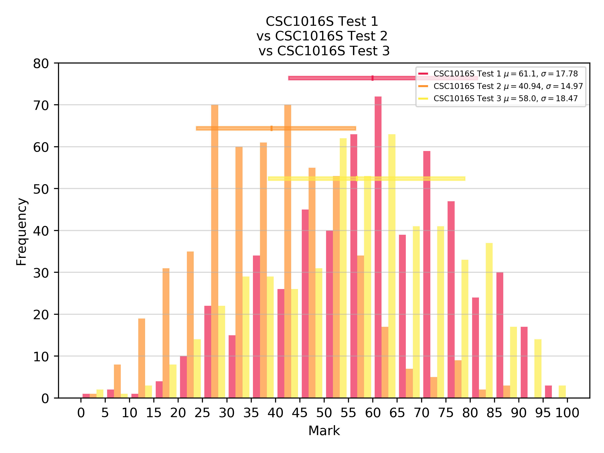

# Marks Analysis

* Source files should be in _data/
* Source files should be formatted like so:
  * first line has the test total, followed by the name used for the legend. These are separated by a comma
  * the remaining lines have: an id number/string, the marks for sub-questions, the total mark for that student. These are separated by commas
  * If you don't have the marks for sub-questions, leave that place blank.
  * Because the lines are comma-separated, you must use the decimal point
* For example: 
```
31,CSC1016S Test 3
1231234,,19
1231235,,13
1231236,,11
1231264,,10
1231254,,24.5
1231274,,17
1231238,,21
```

* In the analyse_marks.py file, make the following changes:
  * Update the `files` list to contain relatives paths to the .txt files you want to plot
  * Update `COLOURS` with the hexadecimal colours you want to use
  * Update `SHOULD_SAVE` to a boolean. `True` if you want to save the image, `False` if you want to display it.


# Example Output: 


