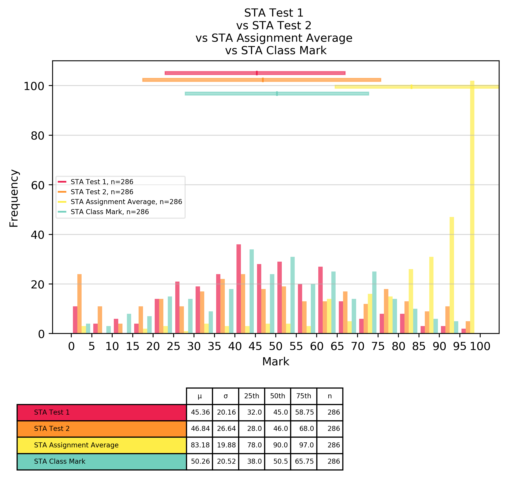

# Marks Analysis

## Formatting and Workflow
* Resultant graphs will go into `graphs/`
* Source files should be in `_data/`
* Source files should be formatted like so:
  * First Line: `[Test Label],[Test Total]`
  * Remaining Lines: `[ID alphanumeric],[Mark for that id]`
* For example: 
```
In text file '_data/csc1000S_test_1_marks.txt'
CSC1000S Test 1,35
1234567,24
1234568,26
1234569,14
1234560,12
1234561,16.5
```
* Please Note:
    * Currently nothing is done with the `ID alphanumeric`'s, however there is a plan to use them in later versions
    * Because the lines are comma-separated, you must use the decimal point
    * If a `mark` is not a numeric, it will be evaluated as zero. (ie `MED`, `ABS`, etc)

## Usage
* In the analyse_marks.py file, make the following changes:
  * Update the `files` list to contain relatives paths to the .txt files you want to plot.
    * Make sure the files are formatted correctly
  * Update `COLOURS` with the hexadecimal colours you want to use
  * Update `SHOULD_SAVE` to a boolean. `True` if you want to save the image, `False` if you want to display it.


# Example Output: 




# To Do: 
* Add better explainations on the graphs for how many student's marks were found to be invalid and therefore omitted


Last Update: 9 October 2019
